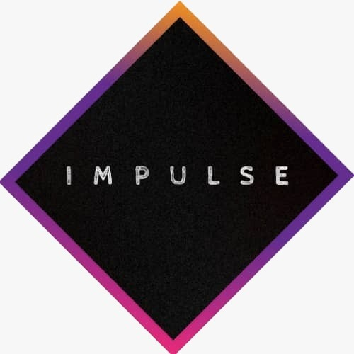

# 🛠️ Moses Odusanya

### [ Systems Architect ]

 

---

### 🏗️ Ecosystem Portfolio (Impulse Engineering)

| Project | System Visualization | Technical Impact |
| :--- | :---: | :--- |
| **[IMPULSE Web App](https://webapp.impulsecoin.tech)** |  | **Lead DevOps:** Cloud provisioning and high-availability deployment. |
| **[Market Analyzer](https://impulsehub.tech/?section=micromax)** |  | **Data Systems Lead:** Real-time pipelines for algorithmic insights. |
| **[Telegram Automation](https://t.me/Impulsehub_bot)** |  | **Automation Lead:** Payment-triggered workflows (Node.js/Python). |
| **[IMPULSE Coin](https://impulsecoin.tech)** |  | **Infrastructure Lead:** Web3 node scaling and environment management. |
| **[IMPULSEHUB Platform](https://impulsehub.tech)** |  | **Systems Architect:** RBAC, multi-service automation, and API orchestration. |

---

### 🛠️ Technical Arsenal (Mastery)

  

---

### 📊 System Performance & Contribution Metrics

---

### 📝 Engineering Logs & Documentation
> [!TIP]
> **View Technical Blueprints:** [Cloud Architecture & Operational Records](https://docs.google.com/document/d/1_FD21MS3sumOkodFvwI0u0F7WJERZL9gyiV7Pm6Gi4o)

  

